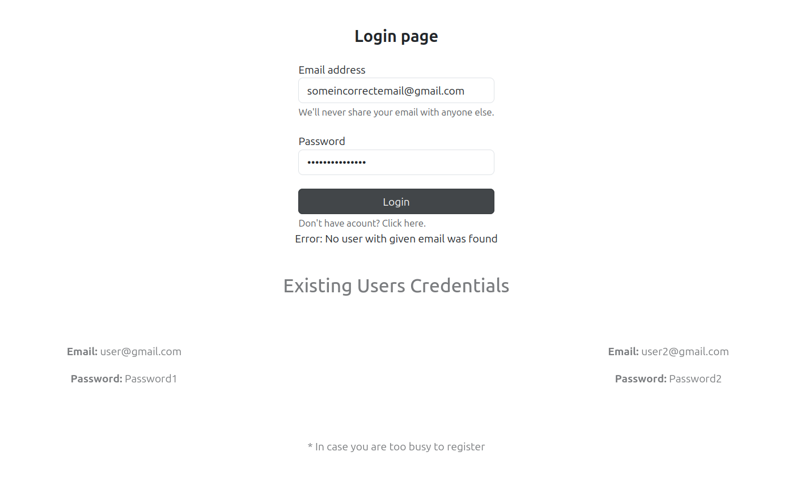

# Reenbit.TestTask

## Structure
- [About Project](#about-project)
- [Used Technologies](#used-technologies)
- [User Instruciton](#user-instruction)

## About Project

- This chat was written for a test task at Reenbit for a .Net + Blazor intern position

- Hours spent: 28

- Features:
    * Jwt Token used

    * Unit Of Work and Base Repository patterns used

    * Secrets are hidden by Azure Key Vault

    * Fully deployed on Azure

## Used technologies

- ASP.NET 8

- Angular v18

- PostgreSQL v16

- Bootstrap v5

- Azure App Service

- Azure Database for PostgreSQL servers

- Azure SignalR

- Azure Cognitive Services Text Analytics

- Azure Key Vault

## User Instruction

- Go to the URL (https://reenbittesttaskchat.azurewebsites.net/)

- Register or log in using your existing data (it may take a few seconds to load)

- Use valid data:
  * email address must contain @gmail.com or another valid domain
  
  * password must contain at least 8 characters

  

- Click the connect button

- Write a message and send it (click the Send button or press the Enter key on your keyboard)

- To close connection click on *Leave chat* button